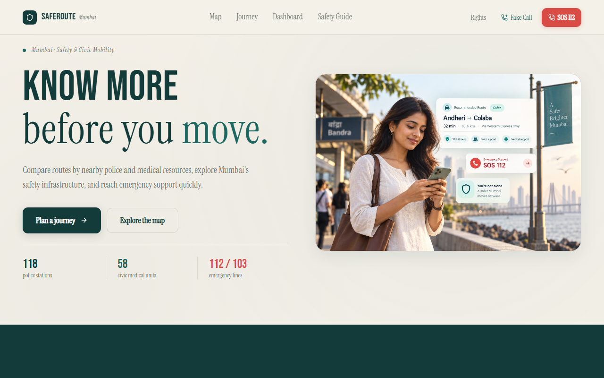
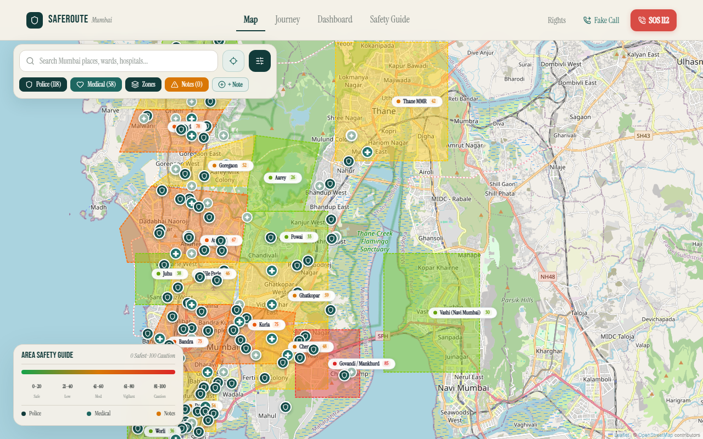
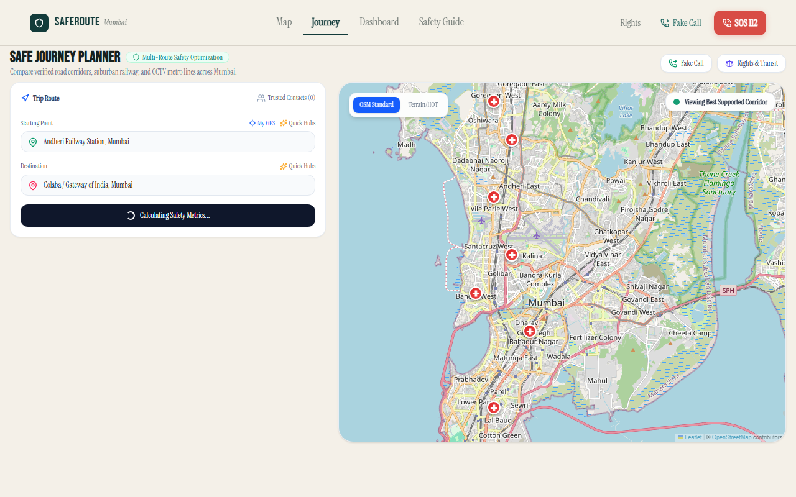
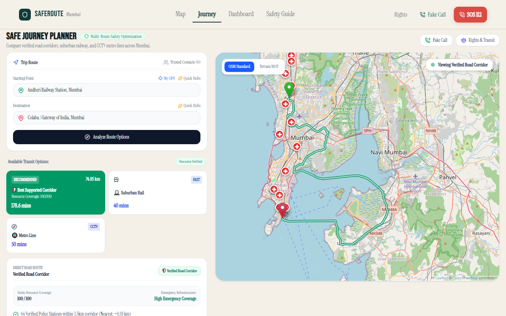
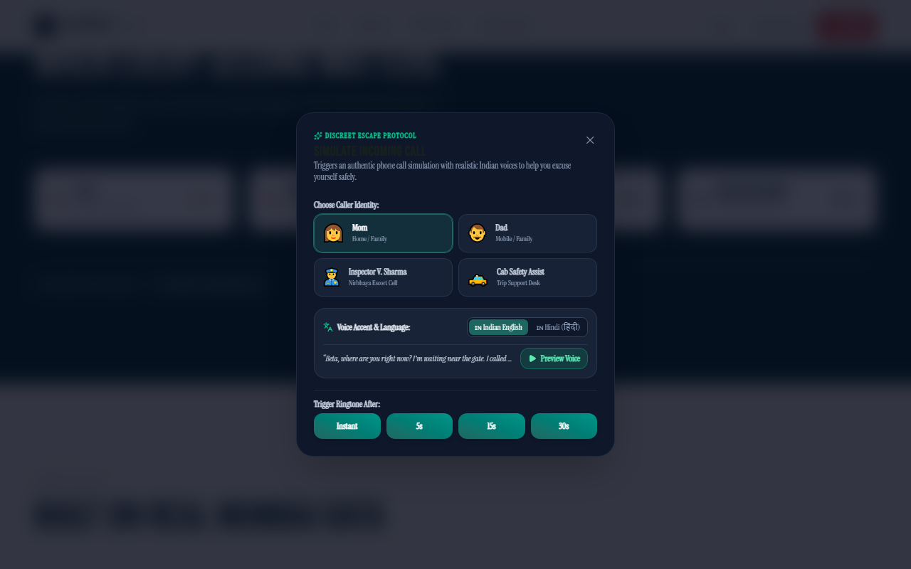
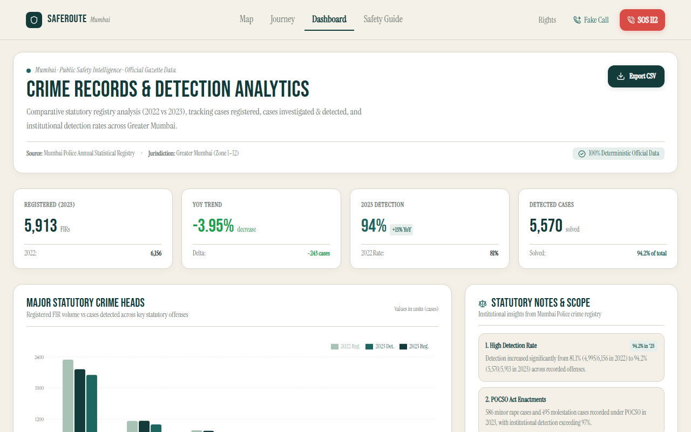
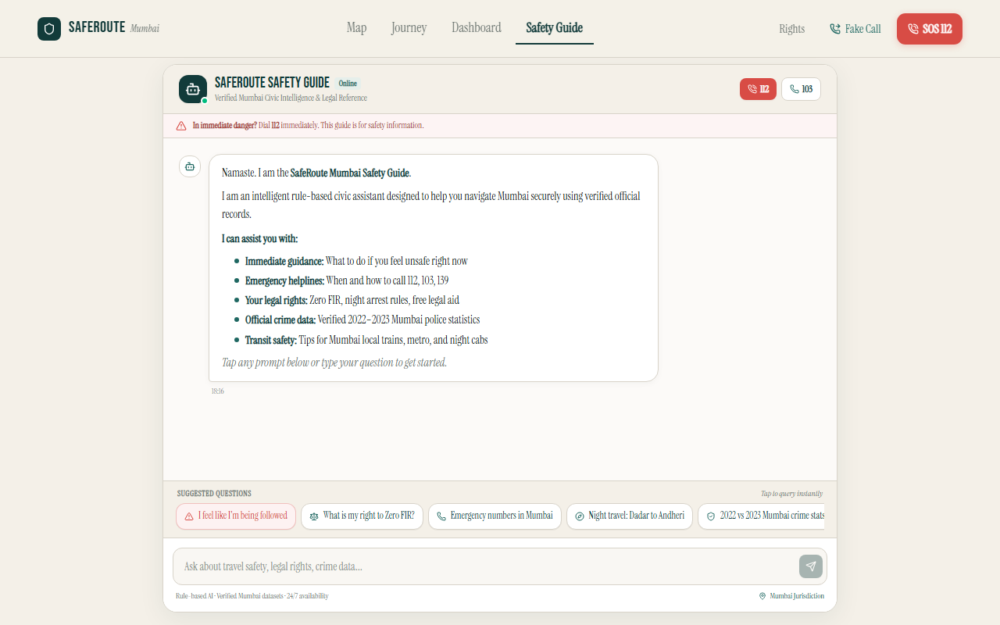
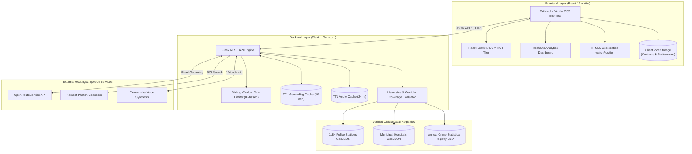

<div align="center">

# 🛡️ SafeRoute Mumbai
### **Navigate Mumbai with context, not guesswork.**

An empirical civic safety and emergency-infrastructure platform for Greater Mumbai combining verified public-safety registries, turn-by-turn road routing, emergency corridor coverage, real-time journey tools, and statutory legal guidance.

<br/>

[](https://github.com/Darshaannn/saferoute-mumbai)
[](https://opensource.org/licenses/MIT)
[](https://vitejs.dev/)
[](https://flask.palletsprojects.com/)
[](https://openrouteservice.org/)

<br/>

**[Features](#-experience-saferoute) • [How It Works](#-how-saferoute-works) • [Coverage Methodology](#-emergency-infrastructure-coverage-score) • [Civic Datasets](#-built-on-verified-civic-data) • [Architecture](#-system-architecture) • [Run Locally](#-local-development-setup)**

<br/>

<p align="center">
  
</p>

</div>

---

## ⚡ SafeRoute at a Glance

SafeRoute Mumbai bridges the gap between daily commuter navigation and civic emergency infrastructure across Greater Mumbai:

- 🛣️ **Real Road Corridor Routing**: Accurate street path computation via OpenRouteService — no straight-line approximations or synthetic paths.
- 🚔 **118+ Verified Police Stations**: Official Mumbai Police GIS locations visualized with corridor buffer and proximity metrics.
- 🏥 **Municipal Emergency Healthcare**: BMC/MCGM municipal referral hospitals and civic maternity clinics mapped across all administrative wards.
- 📊 **Official Crime Statistics (2022 vs 2023)**: Deterministic, macro-level crime registries from the Mumbai Police Crime Records Branch.
- 🛡️ **Emergency Infrastructure Coverage Score (0–100)**: Evidence-based index measuring corridor proximity and density to police and medical facilities.
- ⏱️ **Active Journey & SOS Assistance**: Continuous GPS tracking, configurable check-in timers, one-tap emergency calling (112, 103, 100, 139), and realistic voice escape simulator.
- ⚖️ **Statutory Legal Rights Guidance**: Deterministic assistant delivering protections under the Bharatiya Nagarik Suraksha Sanhita (BNSS, 2023) and Legal Services Authorities Act.
- 🔐 **Privacy by Design**: Zero GPS coordinate tracking on servers, transient geocoding caches, and purely local storage for emergency contacts.

---

## 🚨 The Problem

Standard navigation applications are built for efficiency. They answer:
> **"What is the shortest or fastest route to my destination?"**

They optimize for distance, congestion, and estimated time of arrival. However, when commuting at night, traveling through unfamiliar corridors, or facing an emergency in Greater Mumbai, essential civic context is often missing:
- *Where is the nearest staffed police station along my travel corridor?*
- *Which government referral hospitals or 24x7 emergency centers are within reach?*
- *What emergency services and transport helplines can be contacted instantly?*
- *What legal rights and institutional protections apply if stopped or facing distress?*

Most travelers are forced to switch between navigation apps, search engines, and emergency contact lists in high-stress moments.

---

## 💡 The Solution: What SafeRoute Does Differently

SafeRoute Mumbai does not attempt to predict crime or assign arbitrary "danger ratings" to neighborhoods. Instead, it aggregates **verified civic safety infrastructure** directly onto real road corridors:

```
┌───────────────────────────┐      ┌───────────────────────────┐
│   OFFICIAL CIVIC DATA     │      │   ROAD NETWORK ROUTING    │
│  118+ Police Stations     │  ──▶ │   OpenRouteService Engine │
│  Municipal Hospitals/Care │      │   Real Mumbai Corridors   │
└───────────────────────────┘      └───────────────────────────┘
              │                                  │
              ▼                                  ▼
┌──────────────────────────────────────────────────────────────┐
│           EMERGENCY INFRASTRUCTURE COVERAGE (0–100)          │
│   Deterministic Corridor Proximity & Density Analysis        │
└──────────────────────────────────────────────────────────────┘
              │                                  │
              ▼                                  ▼
┌───────────────────────────┐      ┌───────────────────────────┐
│    ACTIVE JOURNEY TOOLS   │      │    EMERGENCY ASSISTANCE   │
│  Continuous GPS Tracking  │  ──▶ │  One-Tap 112 / 103 / 139  │
│  Auto Check-in Timer      │      │  Realistic Voice Escape   │
└───────────────────────────┘      └───────────────────────────┘
```

By presenting public-safety datasets, real road geometry, and emergency utility in a unified interface, SafeRoute provides commuters with **situational awareness grounded in verified facts**.

---

## 📱 Experience SafeRoute

### 1. Civic Safety & Infrastructure Map
Explore 118+ verified police stations, BMC general hospitals, maternity healthcare centers, and administrative ward boundaries. Features live GPS locating, humanitarian map tile layers, and radius checks.

<p align="center">
  
</p>

- **Interactive Layers**: Toggle police stations, hospitals, and administrative zones independently.
- **Accurate Coordinates**: Sourced directly from MCGM/BMC GIS spatial registries.
- **Dynamic Proximity**: Real-time distance calculation from user location or selected landmark.

---

### 2. Safe Journey Planner & Corridor Analysis
Plan journeys across Greater Mumbai by car or public transit (Suburban Rail & Metro Lines). Computes turn-by-turn road geometry, analyzes the route buffer, and calculates the **Emergency Infrastructure Coverage Score (0–100)**.

<p align="center">
  
</p>

- **Real Street Network**: OpenRouteService (ORS) road calculation for genuine driving routes.
- **Corridor Sampling**: Evaluates police and medical infrastructure along checkpoints within 500m intervals.
- **Multimodal Alternatives**: Side-by-side comparison for Western/Central Railway lines and Mumbai Metro corridors.

---

### 3. Active Journey Mode & Safety Check-in Timer
When starting a trip, Active Journey Mode provides continuous GPS monitoring, dynamic travel progress, an automated check-in countdown timer, and immediate SOS access.

<p align="center">
  
</p>

- **Continuous GPS Watch**: High-accuracy `navigator.geolocation.watchPosition` tracking.
- **Check-in Timer**: Configurable safety countdown triggering alerts if not checked in.
- **One-Tap Emergency Dialing**: Immediate links to **112** (National Emergency), **103** (Women's Helpline), **100** (Police Control), and **139** (RailMadad).

---

### 4. Realistic Voice Escape Simulator
A discreet de-escalation tool designed to simulate an authentic incoming phone call when in uncomfortable or suspicious situations in public transit or cabs.

<p align="center">
  
</p>

- **Authentic Personas**: Mom, Dad, Police Inspector (Nirbhaya Cell), and Trip Support.
- **Bilingual Audio**: Natural Indian English (`en-IN`) and Hindi (`hi-IN`) dialogues.
- **Resilient Engine**: ElevenLabs voice proxy with caching and instant browser SpeechSynthesis fallback.

---

### 5. Empirical Crime Analytics Dashboard & Statutory Safety Guide

<p align="center">
  
  
</p>

- **Crime Analytics Dashboard**: Macro-level comparative charts of the official Mumbai Police Crime Records Branch registries (Calendar Years 2022 vs 2023) covering IPC Sec. 354, Kidnapping, Rape, Sec. 498-A, and POCSO enactments with 100% deterministic metrics and CSV export.
- **Mumbai Safety Guide**: Deterministic statutory guidance answering queries on **Zero FIR** (BNSS Sec. 173), sunset arrest safeguards for women (BNSS Sec. 43(5)), and free legal aid (Legal Services Authorities Act Sec. 12).

---

## 🔍 How SafeRoute Works

SafeRoute operates in a 4-stage civic intelligence pipeline:

```
[01: Route Input] ──▶ [02: Street Geometry] ──▶ [03: Corridor Spatial Audit] ──▶ [04: Active Journey & Tools]
 Origin & Dest         OpenRouteService          Police & Hospital Buffer         Live Tracking & Timers
 Coordinates           Road Network Engine       Coverage Score Calculation       Emergency SOS & Audio
```

1. **Step 01 — Choose Your Journey**: Enter origin and destination landmarks or use live GPS geocoded via Komoot Photon / OSM Nominatim.
2. **Step 02 — Compute Real Street Geometry**: The Flask backend queries OpenRouteService for turn-by-turn road coordinates, distance, and duration.
3. **Step 03 — Audit Emergency Infrastructure**: The system samples route coordinates every 500m and runs spatial KD-tree/Haversine checks against 118+ verified police stations and municipal hospitals.
4. **Step 04 — Travel with Active Journey Tools**: Access continuous location tracking, safety timers, one-tap helplines, transit rights, and emergency escape tools throughout the trip.

---

## 📐 Emergency Infrastructure Coverage Score

SafeRoute calculates an **Emergency Infrastructure Coverage Score (0–100)** along travel corridors.

> [!IMPORTANT]
> **What this score represents**: A mathematical index measuring physical proximity and density of verified civic emergency infrastructure (police stations and municipal hospitals) along the selected route.
>
> **What this score is NOT**: It is **not** a predictive "crime safety score" and does **not** guarantee that a route is free from danger.

$$\text{Coverage Score} = \text{Police Proximity (40)} + \text{Police Density (20)} + \text{Medical Proximity (25)} + \text{Medical Density (15)}$$

| Component | Max Points | Evaluation Criteria |
| :--- | :---: | :--- |
| **Police Proximity** | **40 pts** | Nearest police station: $\le 1.0\text{km}$ (**40 pts**), $\le 2.0\text{km}$ (**30 pts**), $\le 3.5\text{km}$ (**20 pts**), $\le 5.0\text{km}$ (**10 pts**), $> 5.0\text{km}$ (**5 pts**) |
| **Police Density** | **20 pts** | Count of active police stations within a $3.5\text{km}$ corridor buffer: $\min(\text{count} \times 4, 20)$ |
| **Medical Proximity** | **25 pts** | Nearest municipal hospital: $\le 1.5\text{km}$ (**25 pts**), $\le 3.0\text{km}$ (**18 pts**), $\le 4.5\text{km}$ (**10 pts**), $> 4.5\text{km}$ (**5 pts**) |
| **Medical Density** | **15 pts** | Count of municipal medical centers within a $4.0\text{km}$ corridor buffer: $\min(\text{count} \times 3, 15)$ |

---

## 📊 Built on Verified Civic Data

SafeRoute uses verified public records, statutory enactments, and open-source geospatial registries:

| Data Domain | Purpose in SafeRoute | Primary Source Authority |
| :--- | :--- | :--- |
| **Crime Statistics** | Macro comparative analytics (2022 vs 2023) | **Mumbai Police Crime Records Branch** / BPR&D |
| **Police Stations** | 118+ verified police station locations & wards | **MCGM / BMC GIS Database** & Mumbai Police Registry |
| **Municipal Hospitals** | Emergency medical centers & public hospitals | **Open Data Mumbai** / MCGM Public Health Dept |
| **Maternity Clinics** | Specialized civic healthcare outposts | **MCGM Public Health Department GIS** |
| **Road Network** | Turn-by-turn driving geometry & routing | **OpenRouteService (ORS)** / OpenStreetMap |
| **Geocoding & POIs** | Mumbai landmark lookup & address resolution | **Komoot Photon API** / OpenStreetMap Nominatim |
| **Legal Protections** | Statutory rights, Zero FIR, arrest safeguards | **Bharatiya Nagarik Suraksha Sanhita (BNSS, 2023)** |

> [!NOTE]
> For complete spatial schemas, KML references, and data boundaries, refer to [`DATA_SOURCES.md`](./DATA_SOURCES.md) and [`METHODOLOGY.md`](./METHODOLOGY.md).

---

## 🏗️ System Architecture

SafeRoute Mumbai is built with a decoupled, high-performance architecture optimized for reliability and zero client secret exposure:



---

## 💻 Tech Stack

### Frontend
- **Framework**: React 19, Vite 8
- **Mapping & Geospatial**: Leaflet, React-Leaflet, OpenStreetMap (Standard & HOT Humanitarian tiles)
- **Data Visualization**: Recharts, Lucide Icons
- **Animation & Transitions**: Framer Motion
- **Styling**: Modern Vanilla CSS Design Tokens + TailwindCSS

### Backend & Analytics
- **API Framework**: Python 3.10+, Flask, Gunicorn
- **Routing Engine**: OpenRouteService (ORS) REST API
- **Geocoding**: Komoot Photon API, OSM Nominatim (bounded to Mumbai MMR)
- **Voice Synthesis Engine**: ElevenLabs REST API proxy with in-memory SHA256 caching & Web SpeechSynthesis fallback
- **Security & Caching**: In-memory sliding window rate limiter, TTL-based geocoding cache

### Infrastructure & Deployment
- **Frontend Hosting**: Vercel
- **Backend Hosting**: Render (Web Service)
- **Testing**: Pytest (Backend API suite), Playwright (E2E testing)

---

## 🔐 Privacy & Responsible Design

1. **Explicit Location Access**: GPS coordinates are requested strictly through standard browser permissions. SafeRoute never fabricates user positions.
2. **Zero Server Tracking**: User live locations and route histories are processed client-side. The backend never stores GPS traces or personal identifiers.
3. **Local Storage for Sensitive Data**: Emergency contacts and user preferences remain entirely in browser `localStorage`.
4. **Transient Geocoding Cache**: The server only caches public query strings (e.g. `"dadar station"`) for 10 minutes to minimize external calls. Personal coordinates are never cached.
5. **Zero API Key Leakage**: All third-party credentials (ORS, ElevenLabs) are encapsulated in the server-side environment.

---

## ⚠️ Safety Disclaimer

> [!CAUTION]
> SafeRoute Mumbai is a civic informational tool and emergency-assistance aid. It does **not** guarantee route safety or predict individual crime events. In any active emergency or immediate danger, contact official authorities immediately:
> - **National Emergency Number**: `112`
> - **Mumbai Women Police Helpline**: `103`
> - **Mumbai Police Control Room**: `100`
> - **RailMadad Indian Railways Helpline**: `139`

---

## 🌟 Why SafeRoute Matters

Most mapping tools tell you **how to get there**. SafeRoute answers:
> **"What emergency and civic resources exist around me while getting there?"**

By synthesizing official police GIS coordinates, hospital networks, real road geometry, statutory legal rights, and discreet de-escalation tools into a single platform, SafeRoute turns open civic data into actionable peace of mind for Greater Mumbai commuters.

---

## 🛠️ Local Development Setup

### Prerequisites
- **Node.js**: v18.0 or higher
- **Python**: v3.10 or higher
- **Git**

### 1. Clone the Repository
```bash
git clone https://github.com/Darshaannn/saferoute-mumbai.git
cd saferoute-mumbai
```

### 2. Backend Setup
```bash
cd backend

# Create and activate virtual environment
python -m venv venv
# On Windows:
.\venv\Scripts\activate
# On macOS/Linux:
# source venv/bin/activate

# Install dependencies
pip install -r requirements.txt

# (Optional) Configure environment variables
# cp .env.example .env

# Run the Flask backend
python app.py
```
*Backend runs on `http://127.0.0.1:5000`.*

### 3. Frontend Setup
```bash
cd ../frontend

# Install node dependencies
npm install

# Start the Vite development server
npm run dev
```
*Frontend runs on `http://localhost:5173`.*

---

## 🔌 API Reference

<details>
<summary><strong>Click to view complete REST API documentation</strong></summary>

<br/>

| Endpoint | Method | Rate Limit | Description |
| :--- | :--- | :--- | :--- |
| `/api/health` | `GET` | — | Service health check and OpenRouteService connection status |
| `/api/crimes/summary` | `GET` | — | City-wide 2022 vs 2023 Mumbai Police statistical registry summary |
| `/api/police-stations` | `GET` | — | GeoJSON FeatureCollection of 118+ verified Mumbai Police Stations |
| `/api/hospitals` | `GET` | — | GeoJSON FeatureCollection of municipal referral & general hospitals |
| `/api/maternity-homes` | `GET` | — | GeoJSON FeatureCollection of municipal maternity clinics |
| `/api/zones` | `GET` | — | GeoJSON boundaries for Mumbai administrative zones/wards |
| `/api/geocode?q=<text>` | `GET/POST`| 60 req/min | Debounced POI geocoding with 10-minute in-memory cache |
| `/api/reverse-geocode` | `GET` | 60 req/min | Reverse coordinate lookup bounded to Mumbai MMR |
| `/api/journey/analyze` | `POST` | 30 req/min | Real road routing, corridor waypoint sampling, and coverage score calculation |
| `/api/assistant` | `POST` | 60 req/min | Deterministic legal rights (BNSS), helpline, and transit safety assistant |
| `/api/tts/synthesize` | `POST` | 30 req/min | Secure voice synthesis proxy with in-memory audio caching |
| `/api/tts/status` | `GET` | — | TTS proxy status, voice engines, and cache hit metrics |

</details>

---

## 📁 Repository Structure

```
saferoute-mumbai/
├── backend/
│   ├── app.py                      # Core Flask application, routing & TTS proxy
│   ├── data/
│   │   ├── crime_stats_summary.json # 2022 vs 2023 Mumbai Police crime registry
│   │   ├── mumbai_hospitals.geojson # Municipal hospitals spatial dataset
│   │   ├── mumbai_maternity_homes.geojson # Municipal maternity clinics dataset
│   │   ├── mumbai_zones.geojson    # Administrative ward boundaries
│   │   └── police_stations.geojson # 118+ verified police stations dataset
│   ├── tests/
│   │   └── test_api.py             # Pytest test suite covering endpoints & limits
│   ├── requirements.txt            # Python dependencies
│   └── .env.example                # Environment variable template
├── frontend/
│   ├── src/
│   │   ├── components/             # Reusable UI modals, navigation & audio simulator
│   │   ├── data/                   # Transit lines, safe havens, and fallback datasets
│   │   ├── pages/                  # LandingPage, SafetyMap, SafeJourney, Dashboard, AIAssistant
│   │   ├── services/               # API client and geocoding handlers
│   │   ├── App.jsx                 # Client routing and layout
│   │   └── main.jsx                # React root entry point
│   ├── public/                     # Icons, static assets, and pre-rendered audio
│   └── package.json                # Frontend dependencies and build scripts
├── docs/
│   └── assets/                     # Polished application screenshots and architecture assets
├── DATA_SOURCES.md                 # Complete statutory datasets and KML provenance specifications
├── METHODOLOGY.md                  # Mathematical coverage scoring formulas & privacy ethics
└── README.md                       # Main project presentation & documentation
```

---

## 🚀 Deployment Guide

<details>
<summary><strong>View Production Deployment Steps (Render + Vercel)</strong></summary>

<br/>

### Backend on Render (Web Service)
1. Create a new **Web Service** on [Render](https://render.com/).
2. Connect your repository.
3. Configure settings:
   - **Root Directory**: `backend`
   - **Environment**: `Python 3`
   - **Build Command**: `pip install -r requirements.txt`
   - **Start Command**: `gunicorn app:app`
4. Set Environment Variables:
   - `ORS_API_KEY`: *(Optional)* OpenRouteService key for live routing.
   - `ELEVENLABS_API_KEY`: *(Optional)* ElevenLabs key for voice proxy.
   - `FLASK_DEBUG`: `false`

### Frontend on Vercel
1. Import the repository into [Vercel](https://vercel.com/).
2. Configure project:
   - **Framework Preset**: `Vite`
   - **Root Directory**: `frontend`
   - **Build Command**: `npm run build`
   - **Output Directory**: `dist`
3. Add Environment Variable:
   ```env
   VITE_API_BASE_URL=https://your-render-backend.onrender.com
   ```

</details>

---

## 🗺️ What's Next (Roadmap)

- [ ] **Real-time Transit Integration**: Ingest live BEST bus and suburban train timetable telemetry.
- [ ] **Offline PWA Caching**: Full offline caching of emergency police station contacts and municipal hospital directories via Service Workers.
- [ ] **Street Lighting & Crowd Infrastructure Audits**: Community-contributed, verified audits of street lighting and active public booths.
- [ ] **Expanded MMR Coverage**: Extend high-density spatial indexing to Thane, Navi Mumbai, Kalyan-Dombivli, and Mira-Bhayandar.

---

## 👥 Project & Credits

**SafeRoute Mumbai** was engineered for Greater Mumbai with a commitment to civic utility, scientific honesty, and open data transparency.

- **Author / Lead Developer**: [Darshan Gadhave](https://github.com/Darshaannn)
- **Repository**: [https://github.com/Darshaannn/saferoute-mumbai](https://github.com/Darshaannn/saferoute-mumbai)
- **Documentation**: Sourced from official MCGM/BMC open data registries and statutory provisions under BNSS 2023.

<div align="center">

Built with ❤️ for Mumbai.

</div>
